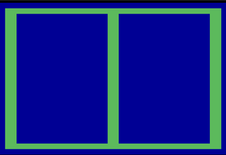

# asm-playfield

Simple playfield written in assembly for Atari 2600 (MOS 6507).



## Prerequisites

- [dasm](https://dasm-assembler.github.io/)
- [Stella](https://stella-emu.github.io/)
- `make` (platform specific)

## Compilation

```cmake
make
```

## Execution

```cmake
make run
```
